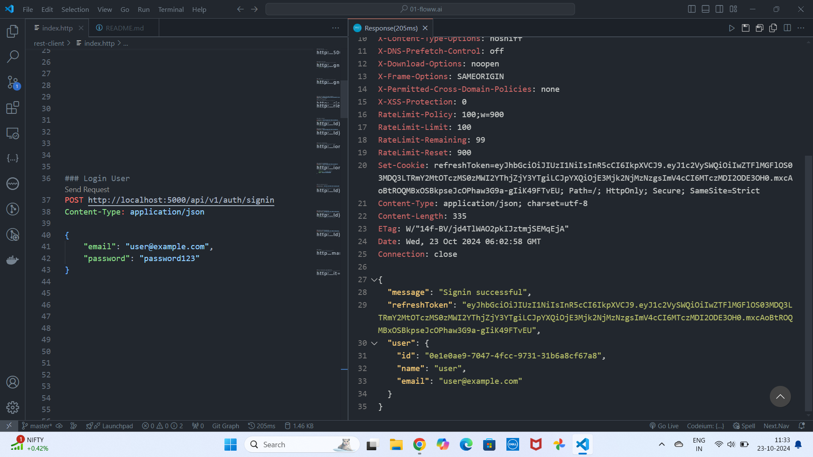

# Personal Expense Tracker

### Techstack

1. Environment : `NodeJS`
2. Language : `Typescript`
3. Server : `express`
4. ORM : `prismaORM`
5. Database : `SQLite`

### Project Features

1. Basic Setup
2. Clean Code : `husky, eslint, prettier`
3. Middlewares
   1. Express Built-in Middlewares
   2. Third-party Middlewares
4. Handlers
   1. Error Handler
   2. Response Handler
   3. Async Handler
5. Authentication : `JWT (JSON Web Tokens)`
6. Validation : `zod`
7. QueryParams
8. Logger
9. swagger
10. API Design :`routes -> controllers -> services -> repositories -> Database`

### Installation

- `npm install`

### Start the Server

- Prisma Format : `npx prisma format`
- Connect prismaClient : `npx prisma generate`
- Migrations : `npm run migrate`
- Seeds : `npm run seed`
- Development : `npm run dev`
- Prisma Studio (Database) : `npx prisma studio`

### API Documentation -> Screenshots

